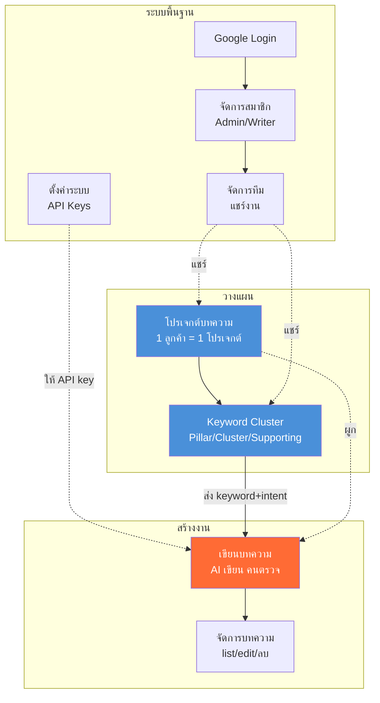
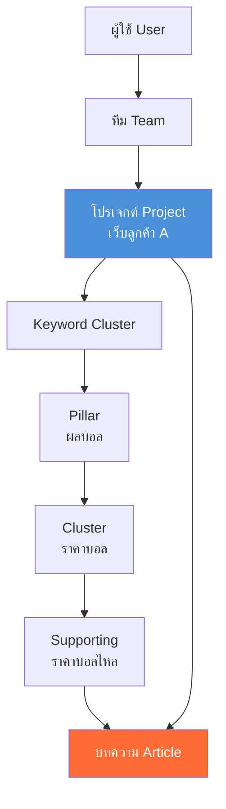
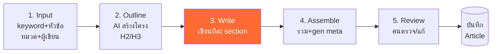
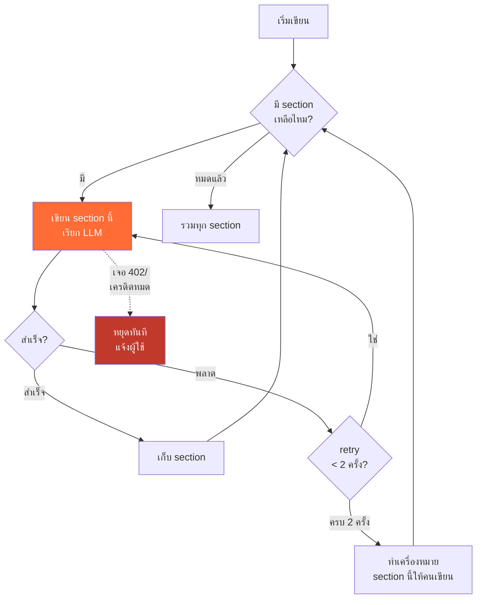
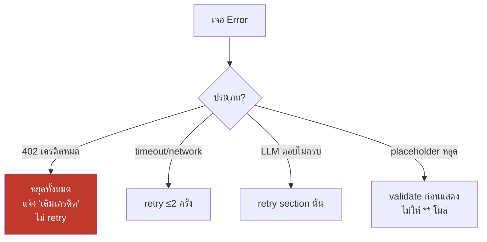
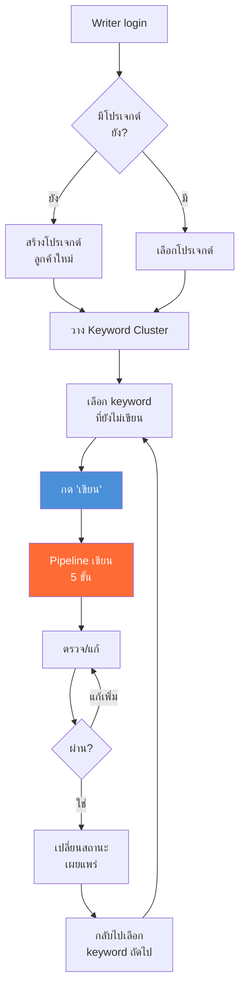
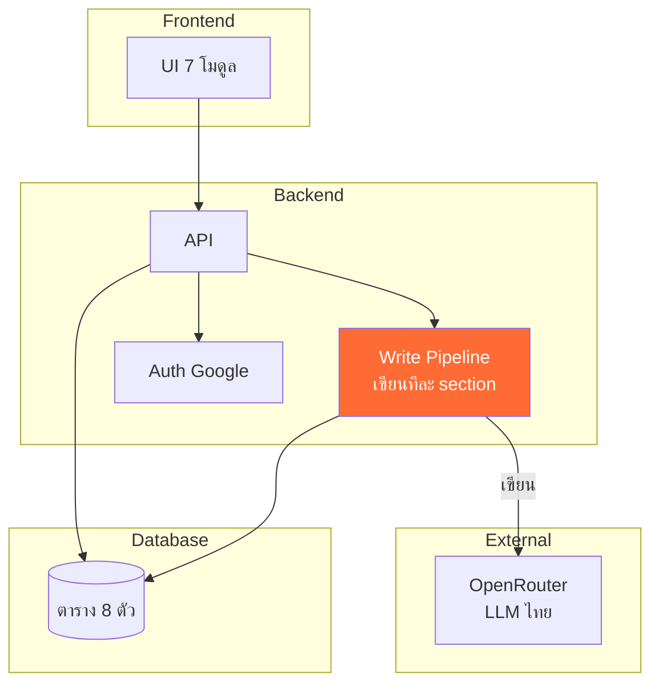
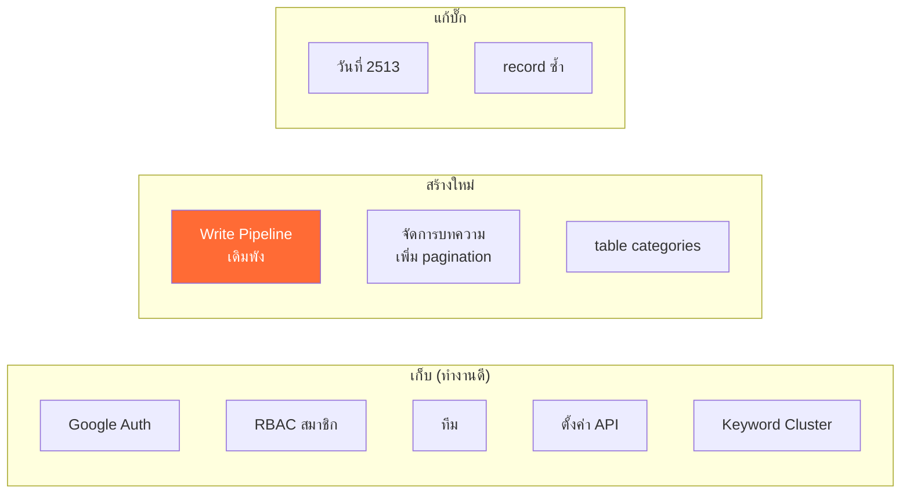

# EEAT Pro Studio v2 — ออกแบบระบบ (System Design)

> เอกสารออกแบบครบ: ผังระบบ + Flow เขียนบทความ + Database Schema
> เน้นแผนภาพดูง่าย (Mermaid) · เวอร์ชัน 1.0

> **วิธีดูแผนภาพ:** ไฟล์ `.md` นี้ถ้าเปิดใน GitHub, VS Code (ติดตั้ง Mermaid preview), หรือ Notion จะเห็นแผนภาพเป็นรูป — ถ้าเปิดใน editor ธรรมดาจะเห็นเป็นโค้ด (ก็อปโค้ดไปวางที่ mermaid.live ดูภาพได้)

---

## สารบัญ

1. [ผังระบบทั้งหมด (7 โมดูล)](#1-ผังระบบทั้งหมด)
2. [ลำดับชั้นข้อมูล (Data Hierarchy)](#2-ลำดับชั้นข้อมูล)
3. [Flow เขียนบทความ (หัวใจ)](#3-flow-เขียนบทความ)
4. [Flow การใช้งานจริง (User Journey)](#4-flow-การใช้งานจริง)
5. [Database Schema](#5-database-schema)
6. [สถาปัตยกรรมเทคนิค](#6-สถาปัตยกรรมเทคนิค)

---

## 1. ผังระบบทั้งหมด

ภาพรวม 7 โมดูล + ความสัมพันธ์ระหว่างกัน



**อ่านผัง:**
- **สีส้ม (เขียนบทความ)** = หัวใจของระบบ
- **สีฟ้า (โปรเจกต์/Cluster)** = ส่วนวางแผนที่ป้อนงานเข้าการเขียน
- เส้นทึบ = ส่งข้อมูลจริง, เส้นประ = เชื่อมโยง/ผูก
- **จุดสำคัญ:** Keyword Cluster → ส่ง keyword+intent → เขียนบทความ (แก้ "ท่อขาด" ของระบบเดิม)

---

## 2. ลำดับชั้นข้อมูล

โครงสร้างว่าอะไรอยู่ใต้อะไร



**อธิบาย:**
- 1 ผู้ใช้ → หลายทีม
- 1 ทีม → หลายโปรเจกต์ (ลูกค้า)
- 1 โปรเจกต์ → 1 Keyword Cluster (Pillar/Cluster/Supporting)
- แต่ละ keyword → 1 บทความ
- บทความผูกกับทั้ง keyword และโปรเจกต์

---

## 3. Flow เขียนบทความ (หัวใจ)

### 3.1 ภาพรวม Pipeline (5 ขั้น)



### 3.2 เจาะขั้น "Write" — เขียนทีละ section (แก้ปัญหาพังกลางทาง)



**จุดแก้จากระบบเดิม:**

| ปัญหาเดิม | วิธีแก้ในผังนี้ |
|---|---|
| เขียนรวดเดียว → พังทั้งบทความ | เขียนทีละ section → พังแค่ section เดียว |
| 402 retry รัว → เผาเครดิต | เจอ 402 → หยุดทันที (กล่องแดง) |
| section พัง → ค้าง | retry 2 ครั้ง → ถ้าไม่ได้ mark ให้คนเขียน (ไม่ค้าง) |

### 3.3 การจัดการ Error (สำคัญ — แก้ปัญหาเดิม)



---

## 4. Flow การใช้งานจริง (User Journey)

เส้นทางจริงตั้งแต่เริ่มจนได้บทความ



**จุดเด่น:** keyword ที่เขียนแล้วจะเปลี่ยนสถานะใน Cluster (เขียนแล้ว/ยังไม่เขียน) → รู้ว่าทำไปแค่ไหน กันเขียนซ้ำ

---

## 5. Database Schema

### 5.1 ภาพรวมตาราง + ความสัมพันธ์

```mermaid
erDiagram
    USERS ||--o{ TEAM_MEMBERS : "อยู่ในทีม"
    TEAMS ||--o{ TEAM_MEMBERS : "มีสมาชิก"
    TEAMS ||--o{ PROJECTS : "มีโปรเจกต์"
    PROJECTS ||--o{ CLUSTERS : "มี cluster"
    CLUSTERS ||--o{ KEYWORDS : "มี keyword"
    KEYWORDS ||--o| ARTICLES : "→ บทความ"
    PROJECTS ||--o{ ARTICLES : "มีบทความ"
    USERS ||--o{ ARTICLES : "เขียนโดย"
    CATEGORIES ||--o{ PROJECTS : "หมวด"
    CATEGORIES ||--o{ ARTICLES : "หมวด"

    USERS {
        id pk
        email unique
        name
        role "admin/writer"
        created_at
    }
    TEAMS {
        id pk
        owner_id fk
        name
    }
    TEAM_MEMBERS {
        id pk
        team_id fk
        user_id fk
        role "owner/admin/member"
    }
    CATEGORIES {
        id pk
        name
        slug
        icon
        is_active
    }
    PROJECTS {
        id pk
        team_id fk
        category_id fk
        name
        main_keyword
        created_at
    }
    CLUSTERS {
        id pk
        project_id fk
        name
        type "pillar/cluster/supporting"
        parent_id fk "self-ref"
    }
    KEYWORDS {
        id pk
        cluster_id fk
        keyword
        intent "info/trans/commercial"
        status "written/pending"
    }
    ARTICLES {
        id pk
        project_id fk
        keyword_id fk
        author_id fk
        category_id fk
        title
        content
        meta_title
        meta_description
        status "draft/published"
        created_at
    }
```

### 5.2 อธิบายตารางสำคัญ

**CATEGORIES (ใหม่ — แก้ปัญหา hardcode)**
- ย้ายหมวดจาก hardcode → table → เพิ่ม/ลบเองได้
- `is_active` = soft delete (ไม่ลบจริง เพราะมีบทความผูก)

**CLUSTERS (self-reference)**
- `parent_id` ชี้ตัวเอง → ทำโครง Pillar → Cluster → Supporting
- `type` บอกว่าเป็นชั้นไหน

**KEYWORDS**
- `intent` = ส่งเข้า pipeline เขียน (บอก AI ว่าเขียนโทนไหน)
- `status` = เขียนแล้ว/ยังไม่เขียน (แสดงใน Cluster)

**ARTICLES**
- `content` = markdown, แยก `meta_title`/`meta_description`
- ผูก 4 อย่าง: project, keyword, author, category
- **ไม่มี** field วัดผลซับซ้อน (ตัด EEAT/AEO score ออก v1)

### 5.3 จุดแก้บั๊กเดิมใน schema

| บั๊กเดิม | แก้ใน schema |
|---|---|
| วันที่ 1/1/2513 | `created_at` ตั้ง default = now() ที่ระดับ DB |
| email ซ้ำ | `email unique` constraint |
| category เพี้ยน | ผูก `category_id` (fk) ไม่ใช่ text |
| หมวด hardcode | table CATEGORIES |

---

## 6. สถาปัตยกรรมเทคนิค

### 6.1 ภาพรวม Layer



### 6.2 สิ่งที่เก็บจากเดิม vs สร้างใหม่



### 6.3 หลักการเทคนิคสำคัญ

**v1 ต้องการแค่:**
- 1 LLM provider (OpenRouter — มีแล้ว)
- ไม่ต้อง SERP/research (เพิ่ม v2)
- ไม่ต้อง background worker (batch ตัดออก — เขียนแบบ sync ทีละบทความ)

**หลักการ pipeline เขียน:**
- เขียนทีละ section (ไม่รวดเดียว)
- retry limit 2 + หยุดเมื่อ 402
- validate output (ไม่ให้ placeholder หลุด)
- คุมประโยค < 25 คำ

---

## สรุป

เอกสารนี้ให้ภาพครบ 3 มุม:
1. **ผังระบบ** — 7 โมดูลเชื่อมกันยังไง (หัวใจ = เขียนบทความ, ป้อนด้วย Cluster+Project)
2. **Flow เขียน** — pipeline 5 ขั้น + เขียนทีละ section + error handling (แก้ทุกปัญหาเดิม)
3. **Schema** — 8 ตาราง + แก้บั๊ก database เดิมในตัว

**ถัดไปที่ทำได้:** เอา schema นี้ไปสร้าง migration จริง, เขียน prompt สำหรับ pipeline, หรือทำ checklist ให้ dev ลงมือทีละ Phase

> ทำงานคู่กับ `eeat_v2_lean_rebuild.md` (แผนภาพรวม) และ `eeat_pro_studio_audit_report.md` (อ้างอิงบั๊กเดิม)

---

## 7. ข้อเน้นย้ำถึงทีมพัฒนา (Notes to Dev Team)

> ส่วนนี้คือ "บทเรียนราคาแพง" จากระบบเดิมที่พังไปแล้ว — อ่านก่อนเริ่มโค้ด สำคัญพอๆ กับ design

### 🔴 กฎเหล็ก 5 ข้อ (ห้ามละเมิด)

**1. อย่าสร้างทุกอย่างพร้อมกัน — ทำ Phase 2 ให้เขียนได้จริงก่อน**

นี่คือสาเหตุที่ระบบเดิมพัง: สร้าง 25 เมนู + 10 step + 4 ระบบวัดผล พร้อมกัน จนไม่มีอะไรเสร็จจริง (209 บทความ เผยแพร่ได้แค่ 1)

→ **ทำให้เขียนได้จริง 10 บทความก่อน ห้ามแตะโมดูลอื่นจนกว่าอันนี้เสร็จ 100%** ถ้าเขียนไม่ได้ อย่างอื่นไม่มีความหมาย

**2. เขียนทีละ section — ห้ามยิง LLM ทีเดียวทั้งบทความ**

ทีมอาจอยากทำง่ายๆ แบบยิงครั้งเดียวจบ — **ห้ามเด็ดขาด** นี่คือสาเหตุที่ระบบเดิมพังกลางทาง เขียนทีละ H2 เท่านั้น เพื่อให้ section พัง retry แค่อันเดียว ไม่ล้มทั้งบทความ

**3. Error handling ทำตั้งแต่แรก ไม่ใช่ทีหลัง**

ระบบเดิมพังเพราะ retry รัวตอน 402 → เผาเครดิตติดลบ ($-0.20) ในระบบที่จ่ายเงินต่อ API call ทุกครั้ง error handling = ป้องกันเงินรั่ว ต้องมีตั้งแต่บรรทัดแรก:
- เจอ 402/เครดิตหมด → **หยุดทันที ห้าม retry**
- retry limit สูงสุด 2 ครั้งเสมอ

**4. อย่าเก็บตัวเลขที่ LLM เดา ว่าเป็น "ข้อมูลจริง"**

ระบบเดิมมี KD/volume ที่แยกไม่ออกว่าจริงหรือ AI เดา ถ้า v2 แสดงตัวเลขใดๆ ต้องรู้ที่มา — ถ้ามาจาก LLM ให้ทำ label ชัด ห้ามปนกับข้อมูลจริง

**5. บั๊ก database แก้ที่ต้นทาง ไม่ใช่ทีละหน้า**

วันที่ 1/1/2513 โผล่ทุกหน้าเพราะแก้ที่ UI ไม่ใช่ model → ตั้ง default timestamp ที่ระดับ database/migration ครั้งเดียวจบ

### 🟡 ข้อควรทำเพิ่ม (ป้องกันซ้ำรอยเดิม)

**6. ทดสอบด้วย keyword จริงหลากหมวด**

ระบบเดิมเทสต์คำเดียวแล้วคิดว่าใช้ได้ → เทสต์อย่างน้อย 5 หมวดต่างกัน (บอล/มวย/สล็อต/อาหาร/ทั่วไป) เพราะ prompt ที่ดีกับหมวดนึงอาจพังกับอีกหมวด

**7. ตั้ง max token + แสดงค่าใช้จ่ายประมาณการต่อบทความ**

กันเผาเครดิต — มี limit ชัดเจนต่อบทความ และแสดงค่าใช้จ่ายประมาณให้ผู้ใช้เห็นก่อนกดเขียน

**8. Log ทุก LLM call (input/output/token/error)**

ระบบเดิม debug ยากเพราะไม่มี log → เก็บ log ทุกครั้งเพื่อหาต้นตอได้ ไม่ต้องเดา

**9. ห้ามเปิด Auto Top-Up เครดิตในช่วงแรก**

จนกว่า pipeline จะพิสูจน์ว่าไม่มี loop เผาเครดิต — เติม manual เท่านั้น

### สรุปถึงทีม dev (1 ประโยค)

> **"ระบบเล็กที่เขียนบทความได้จริง 10 บทความ มีค่ากว่าระบบใหญ่ที่มี 25 เมนูแต่เขียนได้ 1 บทความ — โฟกัสที่ pipeline เขียนให้จบก่อน, error handling ทำตั้งแต่แรก, และอย่าสร้างอย่างอื่นจนกว่าหัวใจจะเต้น"**
